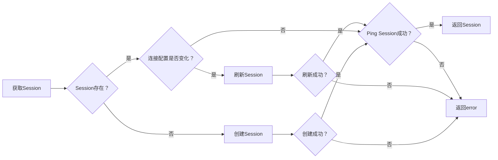
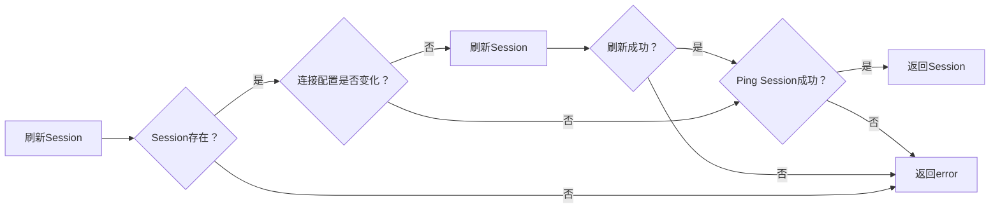

# 客户端会话池设计方案

## 背景

项目中会频繁的使用客户端访问远程服务，如 SSH、Redfish 等，如果每次使用都新建一次连接，会导致建立连接数增加，每次都新建Client然后用完就关闭，会影响性能。添加会话池后，可以做到复用连接，减少新建连接的次数，提高性能。


## 目标

**关键目标**

- 构建通用会话池，能给所有类型的客户端使用；
- 会话池中的连接可以复用，减少新建连接的次数；
- 会话池中的连接可以设置最大活跃时间，超时后会自动关闭；
- 实现 SSH 和 Redfish 客户端的会话池；

**非关键目标**

- 业务使用会话池访问 SSH 和 Redfish 客户端；
- 会话池有最大连接数限制；
- 会话池的整体和重新激活；


## 方案

会话池有两个主要元素，一个是池，一个是池中的元素，我们将池定义为 SessionPool，池中元素定义为 Session。

由于 SessionPool 类似于客户端缓存，因此不需要考虑 Pool 的最大连接数限制。也不需要像传统池一样通过队列来管理 Session 的获取和释放，而是通过 Map 来管理 Session。SessionPool 需要支持以下功能：
- 获取 Session，如果 Session 不存在，则创建一个新的 Session，通过 Session ID 来标识 Session 的唯一性；
- 刷新 Session，如果 Session 相关的认证信息变化或者 Session 连接超时，通过刷新 Session 来更新客户端连接信息；
- 定义回收长期没有使用的 Session；

Session 定义了会话的基本信息以及连接，作为与客户端的中间桥梁，维护了客户端的创建、刷新、重连、关闭等操作。其设计需要最大化的考虑复用性。


### 获取 Session

这是最常用的方法，通过 Session ID 从 SessionPool 中获取 Session，如果 Session 不存在则创建一个新的 Session。创建 Session 需校验 Session 的有效性，只有有效的 Session 才能被缓存。如果 Session 已存在于 SessionPool 中，在获取 Session 时也需要对 Session 进行校验，校验通过后返回 Session，否则尝试刷新 Session。




### 刷新 Session

刷新 Session 用于更新 Session 的连接信息，通常在 Session 的认证信息变化或者连接超时时使用。刷新操作会尝试重新建立连接，并更新 Session 的相关信息。




### 回收 Session

每个 Session 都有一个字段记录活跃时间，当 Session 被获取或者刷新时，会更新活跃时间。SessionPool 会定时扫描所有 Session，根据活跃时间判断是否需要回收 Session。


## 详细设计

### SessionPool

SessionPool 是一个池的抽象接口，范型用于定义 Session 中 Client 的类型，接口函数如下：
- GetOrCreate - 获取 Session，如果 Session 不存在，则创建一个新的 Session；
- Refresh - 刷新 Session，如果 Session 相关的认证信息变化或者 Session 连接超时，通过刷新 Session 来更新客户端连接信息；

```golang
type SessionPool[T any] interface {
    GetOrCreate(sessionID string, cfg any) (Session[T], error)
    Refresh(sessionID string, cfg any) (Session[T], error)
}
```

框架提供默认的结构体 sessionPoolImpl 实现 SessionPool 接口，sessionPoolImpl 包含一个 Map 来存储 Session，Map 的 Key 为 Session ID，Value 为 Session。定义一个 gc 函数，用于定期扫描 Map 中的 Session，根据活跃时间判断是否需要回收 Session。通过 maxIdleHour 属性来设置 Session 的最大活跃时间，gcIntervalHour 属性来设置 gc 函数的执行间隔。创建 sessionPoolImpl 时，会启动一个 goroutine 来执行 gc 函数。

在 sessionPoolImpl 中维护着一个读写锁来处理并发问题，GetOrCreate 会拆分为 getSession() 和 createSession() 两个内部函数，getSession() 使用写锁，createSession() 使用读锁，Refresh() 和 gc() 中对 Session 缓存的处理也会使用写锁。每个 Session 的操作都使用 Session 自己的锁来处理并发问题。

在用 NewSessionPool() 创建 SessionPool 时，可通过 Options 来设置可选属性，如 maxIdleHour、gcIntervalHour 等。


### Session

Session 抽象函数给 SessionPool 使用，范型用于定义 Session 中 Client 的类型，接口函数如下：
- GetID - 返回 Session 的 ID；
- GetClient - 返回 Session 中的客户端实例；
- Ping - 检查 Session 的连接是否可用；
- CompareAndRefresh - 比较 Session 的配置是否变化，如果变化则刷新 Session，通过锁来保障原子操作；
- Close - 关闭 Session，释放资源；
- UpdateLastActiveTime - 更新 Session 的活跃时间；
- GetLastActiveTime - 返回 Session 的活跃时间；

```golang
type Session[T any] interface {
    GetID() string
    GetClient() T
    Ping() error
    CompareAndRefresh(cfg any, force bool) (bool, error)
    Close() error
    UpdateLastActiveTime(t time.Time)
    GetLastActiveTime() time.Time
}
```

框架提供默认的结构体 sessionImpl 实现 Session 接口，sessionImpl 将大多通用逻辑和锁的使用方式都实现了，将不通用的逻辑再抽象为 ClientOperations 接口。业务客户端只需要关注 ClientOperations 接口的实现即可。sessionImpl 的创建函数 newSession() 是 sessionPoolImpl 创建新 Session 时使用的函数。
```golang
func newSession[T any](sessionID string, operations ClientOperations[T], cfg any) (Session[T], error)
```

业务可以通过 SessionPool 先获取 Session，然后再通过 Session 获取 Client 实例。
```golang
session, err := pool.GetOrCreate("SESSION-ID", cfg)
if err != nil {
    // handle error...
}
client := session.GetClient()
...
```


### ClientOperations

ClientOperations 接口定义了客户端的基本操作，客户端业务开发只需要实现这些描述客户端行为的接口函数，无需关注并发性等复杂问题。范型用于定义 ClientOperations 操作的 Client 的类型，接口函数如下：
- NewClient - 创建一个新的客户端；
- Ping - 检查客户端的连接是否可用；
- Compare - 比较两个客户端的配置是否相同；
- Refresh - 刷新客户端的配置；
- Close - 关闭客户端；

```golang
type ClientOperations[T any] interface {
    NewClient(cfg any) (T, error)
    Ping(client T) error
    Compare(old, new any) bool
    Refresh(oldClient T, cfg any) (T, error)
    Close(client T) error
```

ClientOperations 的实现通过创建 SessionPool 时传递，SessionPool 在创建 Session 时也会将 ClientOperations 传递给 Session。
```golang
type MyClientOperations struct {
    client MyClient
}
...

pool := NewSessionPool(ctx, &MyClientOperations{})
```
